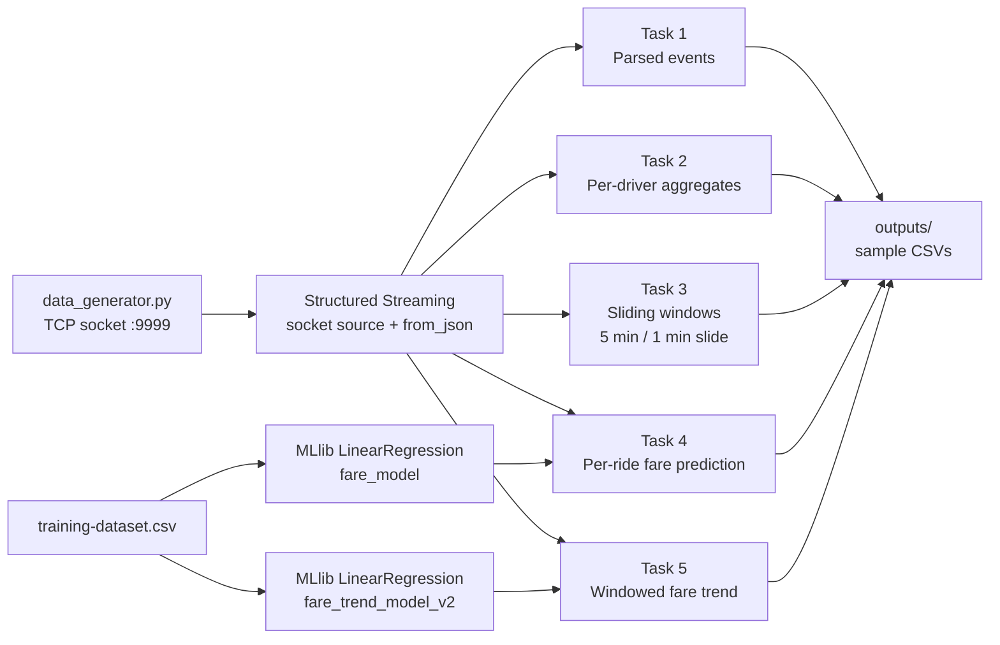

## PySpark Structured Streaming ride analytics: watermarked sliding windows, MLlib fare prediction

A real-time analytics system for a simulated ride-sharing platform, built on Apache Spark Structured Streaming. A Python generator streams ride events as JSON over a TCP socket. Five PySpark applications consume the stream: they parse the events into a typed schema, maintain per-driver aggregates, compute event-time sliding-window metrics bounded by a watermark, and score each ride against Spark MLlib linear regression models trained offline.

---

## Architecture



Each task is an independent Spark application with its own connection to the generator's socket.

| Component | Technology | Responsibility |
|---|---|---|
| Event source | Python TCP socket server | Emits one JSON ride event per line on port 9999 |
| Ingestion | Structured Streaming socket source | Reads the event stream as unbounded micro-batches |
| Parsing | `from_json` with an explicit schema | Converts raw JSON strings into typed columns |
| Stateful aggregation | `groupBy`, `window`, `withWatermark` | Per-driver totals and event-time windowed metrics |
| Machine learning | Spark MLlib (`VectorAssembler`, `LinearRegression`) | Offline training, streaming inference |
| Sinks | Console, `foreachBatch` CSV writers | Live inspection and persisted samples |

### Design highlights

- **Event-time processing.** Windows are computed from each ride's own timestamp, not from when Spark received the event, so results stay correct when events arrive late or out of order.
- **Watermarking for bounded state.** A 1-minute watermark sets how long Spark waits for late data. Once the watermark passes a window's end, the window is finalized and its state is dropped, which keeps memory bounded on an unbounded stream.
- **Sliding and tumbling windows.** Task 3 uses overlapping 5-minute windows that advance every minute. Task 5 uses non-overlapping 5-minute tumbling windows that match its training data.
- **Offline training, streaming inference.** Models are fit once on static data, saved to disk, and applied to live micro-batches with the same feature pipeline.
- **Micro-batch sinks with `foreachBatch`.** Each micro-batch is handled as a static DataFrame, which allows operations streaming DataFrames don't support, such as sorting, and gives full control over how CSVs are written.

---

## Repository Structure

```
pyspark-ride-streaming/
├── data_generator.py          # TCP socket server streaming JSON ride events on 0.0.0.0:9999
├── task1.py                   # Ingestion and JSON parsing
├── task2.py                   # Per-driver aggregations: SUM(fare), AVG(distance)
├── task3.py                   # Sliding windows (5 min / 1 min slide) with a 1-minute watermark
├── task4.py                   # MLlib per-ride fare prediction and deviation
├── task5.py                   # MLlib time-based average fare trend on 5-minute windows
├── training-dataset.csv       # Static training data for both MLlib models
├── requirements.txt           # Python dependencies
├── models/
│   ├── fare_model/            # LinearRegressionModel: distance_km → fare_amount
│   └── fare_trend_model_v2/   # LinearRegressionModel: time features → average fare
└── outputs/
    ├── task_1_samples/        # Parsed events
    ├── task_2_samples/        # Per-driver aggregates
    ├── task_3_samples/        # Sliding-window fare sums
    ├── task_4_samples/        # Per-ride predictions and deviations
    └── task_5_samples/        # Windowed actual vs. predicted average fares
```

## Event Schema

Each event is a single-line JSON object:

```json
{"trip_id": "...", "driver_id": 54, "distance_km": 25.25, "fare_amount": 100.11, "timestamp": "2025-10-14 17:18:05"}
```

| Field | Type | Description |
|---|---|---|
| `trip_id` | string (UUID) | Unique ride identifier |
| `driver_id` | integer | Driver identifier |
| `distance_km` | double | Trip distance in kilometers |
| `fare_amount` | double | Fare charged |
| `timestamp` | string (`yyyy-MM-dd HH:mm:ss`) | Event time; cast to `TimestampType` as `event_time` for windowing |

---

## Prerequisites

- Python 3
- A Java runtime supported by your PySpark version (PySpark runs on the JVM)
- Python dependencies from `requirements.txt`

## Quickstart

### 1. Install dependencies

```bash
pip install -r requirements.txt
mkdir -p logs outputs
```

### 2. Start the event generator (terminal A)

```bash
python data_generator.py
```

The generator listens on `0.0.0.0:9999`, prints `New client connected` whenever a Spark application attaches, and emits one event per line.

### 3. Run a task (terminal B)

```bash
python task1.py
```

Keep the generator running for as long as a task is active. To keep a log of a task's console output:

```bash
python task4.py | tee logs/task4.out
```

---

## Tasks

### Task 1: Ingestion and Parsing

- Reads the stream with `spark.readStream.format("socket")` from `localhost:9999`.
- Parses each line with `from_json(col("value"), schema)` into `trip_id`, `driver_id`, `distance_km`, `fare_amount`, and `timestamp`.
- Prints parsed rows to the console in `append` mode and writes samples to `outputs/task_1_samples/`.

### Task 2: Per-Driver Aggregations

- Groups the stream by `driver_id` and computes:
  - `SUM(fare_amount)` as `total_fare`
  - `AVG(distance_km)` as `avg_distance`
- Writes per-batch snapshots of the running aggregates to `outputs/task_2_samples/` through `foreachBatch`.

### Task 3: Sliding-Window Fare Sums

- Casts `timestamp` to `event_time` (`TimestampType`) and applies `withWatermark("event_time", "1 minute")`.
- Aggregates `SUM(fare_amount)` over `window("event_time", "5 minutes", "1 minute")`, which produces overlapping 5-minute windows that start every minute.
- Sorts each micro-batch inside `foreachBatch` and writes results to `outputs/task_3_samples/`.
- The first finalized window appears after about 6 to 7 minutes: 5 minutes of window, plus the 1-minute watermark, plus micro-batch latency.

### Task 4: Per-Ride Fare Prediction

- **Training:** fits a `LinearRegression` model on `training-dataset.csv`, with `distance_km` as the only feature (assembled by `VectorAssembler`) and `fare_amount` as the label. The model is saved to `models/fare_model/`.
- **Inference:** applies the same feature pipeline to each streaming ride and computes:
  - `predicted_fare`: the model's estimate
  - `deviation = |fare_amount - predicted_fare|`: how far the actual fare is from the expected one, a simple signal for spotting anomalous fares
- Prints results to the console and writes samples to `outputs/task_4_samples/`.

### Task 5: Time-Based Fare Trend

- **Training:** aggregates `training-dataset.csv` into 5-minute tumbling windows and fits a `LinearRegression` model on the time features `hour_of_day` and `minute_of_hour` to predict each window's average fare. The model is saved to `models/fare_trend_model_v2/`.
- **Inference:** aggregates the live stream into the same 5-minute windows with a 1-minute watermark, then outputs `actual_avg_fare` alongside the model's `predicted_next_avg_fare`.
- **Output modes:** in `update` mode, a window is re-emitted whenever late data changes its aggregate. In `append` mode, each window is emitted once, after the watermark finalizes it.

---

## Requirements Mapping

| Requirement | Implementation |
|---|---|
| Ingest from socket | `spark.readStream.format("socket").option("host", "localhost").option("port", 9999)` |
| Parse JSON into columns | `from_json(col("value"), schema).alias("json").select("json.*")` |
| Print parsed data | `writeStream.format("console").outputMode("append")` |
| Per-driver real-time aggregation | `groupBy("driver_id")` with `sum("fare_amount")` and `avg("distance_km")` |
| Persist aggregates | `foreachBatch` CSV writer to `outputs/task_2_samples/` |
| Event-time windowed analytics | `withWatermark("event_time", "1 minute")` and `window("event_time", "5 minutes", "1 minute")` |
| Persist windowed results | `foreachBatch` CSV writer to `outputs/task_3_samples/` |
| Train and serve a fare model | `VectorAssembler(["distance_km"])` and `LinearRegression`, saved to `models/fare_model/` |
| Train and serve a trend model | 5-minute tumbling windows, `hour_of_day` and `minute_of_hour` features, saved to `models/fare_trend_model_v2/` |

---

## Sample Outputs

### Task 1: Parsed events

```
d34e5277-8fd6-4067-8eec-5d63cd06535f,23,39.99,62.85,2025-10-14 17:20:57
55a0a604-202b-4ca8-9520-b938833fa867,49,25.43,8.72,2025-10-14 17:20:58
f669a3b1-834c-40cd-97ac-bcf82333ac8c,19,44.6,118.66,2025-10-14 17:20:56
```

### Task 2: Per-driver aggregates

Columns: `driver_id, total_fare, avg_distance`

```
65,77.11,26.55
78,164.29,23.65
81,215.8,27.56
```

### Task 3: Sliding-window fare sums

```
window_start,window_end,sum_fare_amount
2025-10-14T17:22:00.000Z,2025-10-14T17:27:00.000Z,1626.91
2025-10-14T17:23:00.000Z,2025-10-14T17:28:00.000Z,5892.83
2025-10-14T17:29:00.000Z,2025-10-14T17:34:00.000Z,23518.80
```

### Task 4: Per-ride prediction and deviation

Columns: `trip_id, driver_id, distance_km, fare_amount, predicted_fare, deviation, timestamp`

```
16c873cb-5e73-4adf-896e-a02702552673,15,27.0,72.5,51.06825011249654,21.431749887503457,2025-10-22 22:04:02
74d7b792-3460-48a9-936a-da6d64255127,91,14.59,49.05,28.746938929409502,20.303061070590495,2025-10-22 22:04:03
5d6ec177-230a-4434-b5f2-cf72fa766985,81,11.37,86.55,22.955269146207222,63.594730853792775,2025-10-22 22:04:04
506ce0a4-989e-41c9-83f1-5899a93b8f81,62,4.71,48.88,10.976225433124254,37.90377456687575,2025-10-22 22:04:05
9f9340da-49a4-4ed3-b404-639815a035b8,19,36.27,111.98,67.74178392935528,44.238216070644725,2025-10-22 22:04:06
```

### Task 5: Windowed fare trend

Columns: `window_start, window_end, actual_avg_fare, predicted_next_avg_fare`

```
2025-10-22 22:15:00,2025-10-22 22:20:00,79.0018181818182,48.88266302780869
2025-10-22 22:20:00,2025-10-22 22:25:00,80.50434782608696,48.70300203146776
2025-10-22 22:25:00,2025-10-22 22:30:00,76.59015384615385,48.523341035126826
2025-10-22 22:30:00,2025-10-22 22:35:00,83.46603448275863,48.3436800387859
```

---

## Model Observations

- **Fitted fare model.** The Task 4 samples imply a fitted line of roughly `fare ≈ 1.80 × distance_km + 2.50`.
- **Training/serving skew.** Both models consistently underpredict the live stream. In Task 5, predicted window averages sit near 48 while actual averages range from about 77 to 83. The generator's fare distribution clearly differs from `training-dataset.csv`, so the large deviations in Task 4 largely reflect that mismatch, not anomalous rides.
- **Linear time features.** Encoding `minute_of_hour` as a raw number makes predictions drift steadily within each hour (about 0.18 lower per 5-minute window in the samples) and jump back at the hour boundary. Cyclical encoding (sine and cosine of the hour and minute) would model periodic demand patterns better.

---

## Troubleshooting

| Symptom | Cause | Resolution |
|---|---|---|
| Task 3 writes empty CSVs | No window has been finalized yet | Let it run 6 to 7 minutes. Skip empty micro-batches with `if batch_df.isEmpty(): return` |
| Task 5 emits the same window repeatedly | `update` mode re-emits windows as late data arrives | Use `append` mode to emit each window once, after finalization |
| `Sorting is not supported on streaming DataFrames` | `orderBy` applied to a streaming DataFrame | Sort inside `foreachBatch`, where each micro-batch is static |
| `tee: logs/task4.out: No such file or directory` | The `logs/` directory doesn't exist | Run `mkdir -p logs` first |
| Task can't connect | Generator not running, or port not forwarded | Start `data_generator.py` first. In Codespaces, forward port 9999 |
| Spark UI reports port 4040 in use | Several Spark applications running | Informational only. Spark moves to 4041, 4042, and so on |
| Long floating-point values | Unrounded aggregates | Wrap with `round(..., 2)` |

---

## Limitations and Production Considerations

- **Socket source.** Spark's socket source is meant for testing and doesn't support replay, so data is lost if a job restarts. A production deployment would read from a durable, replayable source such as Apache Kafka or Amazon Kinesis.
- **Checkpointing.** Set `checkpointLocation` on each streaming query so that state and progress survive restarts. Combined with a replayable source, this enables exactly-once processing.
- **Unbounded state in Task 2.** The per-driver aggregation has no watermark or time bound, so its state grows with the number of drivers for as long as the query runs. Windowing it, or using `flatMapGroupsWithState` with timeouts, would bound it.
- **Model lifecycle.** Models are trained once on static data. Retraining on recent stream data and monitoring the gap between predicted and actual fares would reduce the training/serving skew noted above.
